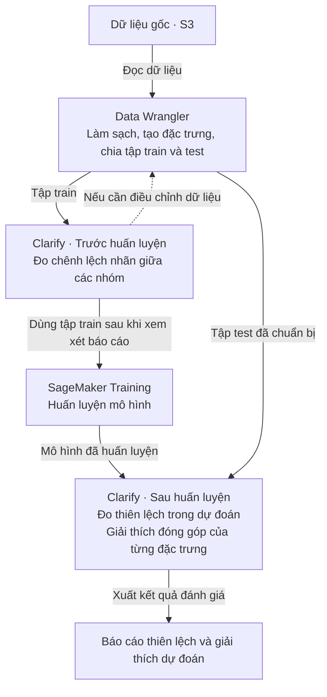

```mermaid
flowchart TD
    RAW["Dữ liệu gốc · S3"] -->|Đọc dữ liệu| WR["Data Wrangler<br/>Làm sạch, tạo đặc trưng, chia tập train và test"]

    WR -->|Tập train| PRE["Clarify · Trước huấn luyện<br/>Đo chênh lệch nhãn giữa các nhóm"]
    PRE -->|Dùng tập train sau khi xem xét báo cáo| TRAIN["SageMaker Training<br/>Huấn luyện mô hình"]
    PRE -.->|Nếu cần điều chỉnh dữ liệu| WR

    TRAIN -->|Mô hình đã huấn luyện| POST["Clarify · Sau huấn luyện<br/>Đo thiên lệch trong dự đoán<br/>Giải thích đóng góp của từng đặc trưng"]
    WR -->|Tập test đã chuẩn bị| POST

    POST -->|Xuất kết quả đánh giá| REPORT["Báo cáo thiên lệch và giải thích dự đoán"]
```

